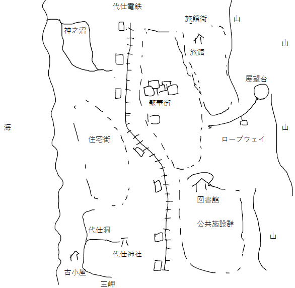

素敵な街
========

プロローグ
==========

木々は紅葉を迎え、さまざまな食べ物がおいしい季節になった頃。
あなた達は、商店街の福引きで一泊二日の観光ツアーチケットを当てた。
ネットで調べると、かなり評判のよい観光地のようだ。
日程も仕事の繁忙期とずれており、気分転換にはちょうど良さそうだ。

あなた達は「代仕町（しろしまち）観光ツアー」に参加することにした。

（PL同士が知り合いだとよい）

――当日――

新幹線で最寄りの駅に集合すると、ツアーガイドの女性が旗を持って観光客を待っていた。
真っ黒な長髪をしたガイドは、ツアー客が集まったことを確認すると、観光バスへと誘導していく。
あなた達はバスに乗車し、他の乗客と一緒に観光バスに揺られて目的地の代仕町へと向かう。
ガイドが色々と説明をしているようだ。

ロールプレイを開始して下さい。

なお、PL同士は近い席に座っている。
簡単な挨拶、雑談とかをしてみて下さい。

ガイド
「皆様、本日は当観光ツアーにご参加くださり、まことにありがとうございます。
わたくしは今回のツアーで皆様のガイドをさせていただきます『せんぼう』と申します。
少し珍しい名字ですので補足させていただきますと、仙人の仙にお坊さんの坊で仙坊と書きます。
これから一泊二日の間、どうぞよろしくお願いいたします。
さて、今回の目的地である代仕町ですが、こちら、昨今ではインターネットの普及もあって有名になりつつありますが、以前は知る人ぞ知る観光名所でありました。
町に面した日本海のおだやかな海。
というと、おや？　と思われる方もいらっしゃるかと思います。
日本海というと、『荒波』というイメージを持たれていらっしゃる方が多いようですが、冬の季節風が吹いていない時期は、日本海というのは太平洋よりも穏やかな海なのです。
そして町を挟んで反対側には山を覆う一面の木々。
特に今の季節は美しい紅葉が見所です。
さらに、夕方時になれば、西に沈む夕日によってあかく染まった海と空、そして紅葉した山々が織りなす景色はとても美しいと評判です。
更に。
代仕町は景色だけではございません。
海と山に面しておりますから、豊富な海の幸・山の幸に恵まれており、食事も大変おいしい所です。
今回は皆様には旅館に宿泊していただきますが、こちらの旅館でも新鮮な食材を使った料理をご用意させて頂いております。
また、代仕町には古くからある地元の外食店も多数ございますので、自由時間等にはどうぞ食べ歩きなども楽しんでいただければと思います」

観光客を飽きさせないように、ガイドはその後も色々と話を続けていた。

気がつけば代仕町に到着していたようだった。
代士町の天気は快晴で、絶好の観光日和だった。

代仕町全体図
============

観光：代仕洞→代仕神社
=======================

ガイド
「まずはこちら、王岬（おうみさき）です。
音だけをお聞きになりますと、近いという字と江戸の江で近江と書くのかなと思われるかも知れませんが、王様の王に岬で王岬と読みます。
その由来は、古くは飛鳥から奈良時代頃、一帯を治めていた、時の君主がこの岬を作り上げたという言い伝えが元になっているそうです。
ご覧のように、海側にむかって急勾配に高くなっていき、海側は絶壁になっております。
では、こちらにお越し下さい」

そう言ってガイドは王岬の海側、絶壁になっている側にツアー客を案内する。

ガイド
「こちらがこの代仕の観光名所の一つ、代仕洞になります。
この代仕洞は鍾乳洞になっておりますが、一般の鍾乳洞との大きな違いは、海との近さに関係しています。
なんとこの代仕洞、地下で海とつながっているのです。
潮の満ち引きに合わせて、洞内に点在する小さな湖のような海水の水位が上がったり、下がったりを繰り返します。
では中に入ってみましょう。
あ、大変申し訳ありませんが、先日洞内の照明器具が故障してしまい、照明が不安定ですので、どうぞお足元にはお気をつけください」

そういってガイドが代仕洞を案内する。
洞内に足を進めると、ガイドの言うとおり、照明が時折明滅したり、数瞬消えたりすることがあった。

ガイドが注意を促しつつ、説明を続けながら奥へと進んでいった。

ガイド
「そしてこちら、代仕洞のもっとも奥にありますのが代仕神社になります。
こちらの神社では八幡様を祀っております。
元は別の神様を祀っていたそうですが、明治時代に政府から発令されました『神社合祀令』に伴って、八幡様がこちらの代仕神社に分祀され、いつしか元々祀っていた神様が忘れ去られてしまった、とのいわれがあります。
また、ご覧になるとわかりますように、本殿の周りにいくつも像があるかと思います。
これらはその踊りを踊っている様子から、『ようしんたい』、踊ると書いてようと読みます、それにご神体の神体をつけて、踊神体。
このように呼ばれており、日本では他に類を見ないことから、希少な文化遺産として大切にされております」

そう言ってガイドはそれでは自由時間とさせていただきますと告げた。

本殿
----

満潮になったときでも海水に浸らないようにするためか、高い位置に本殿が建てられている。
本殿の形式自体に特に変わったところは見受けられない。
一般的な神社の本殿のようだ。

踊神体
------

ガイドが踊神体といった像が不規則に本殿を囲むように並んでいる。
くねっているため、遠目には踊っているようにも見えるが、近くで見ると、とても人間とは思えないような形状をしていた。
一つ一つを確かめてみると、全て違う形状であるが、たしかにそれらはすべて踊っているようにも見えた。

本殿周辺の壁
------------

壁には神社を建てる際に財産を奉納した人物と思われる名前が大量に刻まれていた。
～～右衛門やら、～～麻呂など、かなり古い時代と思われる名前が大量にある。
かなり古い時代から存在し、何度も建て替えが行われてきたようだ。
あなたがそれを眺めていると何か違和感を覚えた。
ちょうどその時にガイドからの招集がかかった。

ガイド
「では自由時間は以上とさせていただき、次の場所まで移動いたします」

観光：繁華街
============

ガイド
「では皆様、お昼の時間でございます。
お昼はこちらの繁華街にて、皆様のお好みのお店に立ち寄っていただければと思います。
特に有名なお店についてはパンフレットの方に記載させて頂いております。
時間は沢山確保いたしておりますので、皆様で隠れた名店を見つけていただくのもよろしいかと思います」

繁華街で自由時間。

散策すると、繁華街というだけあって、一通りの店は揃っているようだった。
だが、やはり飲食店の数が多いように見受けられた。

飲食店には、かなり古い時代の有名人や、今も活躍する有名人のサインが飾ってある。

観光：神之沼
============

ガイド
「こちらが『ごうのぬま』になります。
神様の沼、と書いて、ごうのぬま、と読みます。
水質は汽水。
汽水とは、淡水と海水が混在した状態を指す用語です。
淡水と海水が混在しておりますから、フナやナマズなどの淡水魚から、ハゼ、ボラなどの回遊魚まで、多種多様な魚を見ることができる、とても貴重な沼となっております。
このような汽水の沼というのは非常に希少なため、町全体で神之沼の水質保全に取り組んでいらっしゃるとのことです」

沼という名前はついているものの、水は綺麗で、湖といった方がしっくりくるような景観だった。

散策すると、バーベキューができる広場や、自然公園的な広場などの施設が整えられていることがわかる。

観光：ロープウェイ→山頂からの景色
===================================

観光バスに乗って、ロープウェイ乗り場の駐車場に着く。
道中でも山の木々が紅葉しているのが見えた。

ガイドとロープウェイ乗り場職員の案内でツアー客が次々とロープウェイに乗り込み、山頂に到着する。

ガイド
「皆様がおりますこの山頂から、代士町を一望することができます。
左手側の海岸沿いに見えるのが王岬、右手側に見えるのが、先ほどの神之沼になります。
また、それらの自然の景観とはまた違ったものが、こちらの山頂から見ることができます。
皆様、あちらの住宅街の屋根、またはビルの屋上をごらんになってください。
ソーラーパネルが設置されていることがわかるかと思います。
この代士町は非常に早い段階からオール電化に取り組み、現在は町民の生活のほぼすべて電気でまかなわれています。
特にガスの使用量は極端に少なく、ガスを利用されるケースを町の方に伺ったところ、あえて挙げるならカセットコンロのガスボンベ位だと、笑って答えてくださいました」

山頂からは紅葉した山の木々の景色が一望できた。
西の水平線に沈む夕日が空を朱色に染めていた。

観光：旅館
==========

観光バスに乗って旅館に到着した。
旅館の従業員の案内で、ツアー客はそれぞれ客室に案内されていった。

ガイド達は近くのビジネスホテルに泊まる、何かあれば連絡するか、そちらに来てくれるようにとツアー客に伝え、移動していった。

それぞれの部屋で、新鮮な素材を使ったさまざまな食事を味わうことができた。

風呂は温泉ではなかったが、ゆったりとした大浴場で、一日の疲れを落とすことができた。

PLのひとりが何気なしに紙片を見つける。
（棚の下とか）
その紙片には次のような文章が書いてあった。

『なんなんだこの町は  
なんなんだこの町は  
もういやだ』  
――丸めて転がっていた紙片の殴り書き

少し不気味ではあったが、すぐに忘れ、一日の疲れもあってすぐに眠りについた。

--------------------------------------------------------------

反転イベント
============

従業員
「お客様、朝食のご用意ができております」

あなた達はそれぞれが従業員のドアノックの音で目を覚ました。
時計を見れば、朝食の時間を二十分は過ぎていた。
あなた達は慌てて外出用の服に着替えると、急いでレストランホールへと向かった。
朝食は洋式だという話だった。
エレベーターで一階にあるレストランホールへ向かっていると、途中で他の階に泊まっていたPL達とも合流した。
そして全員でレストランホールへと向かった。

（目星をして、レストランホールに近づくと変なにおいがすることに気づいてもよい）

レストランホールの入り口で客を出迎えるように立っている従業員の深々とした挨拶の脇を通り過ぎ、中へと入っていった。

その瞬間、あなた達は強烈な違和感を感じたが、一瞬ではそれを理解することができなかった。
数瞬後、目に飛び込んできた映像を脳が理解した。
そして全員が言葉を失った。
同行していたツアー客がことごとく椅子に縛り付けられ、ナイフとフォークを握らされ、そして、その頭部があるはずの位置に頭が存在しなかった。
代わりに、ツアー客の目の前の皿に、体と向き合うようにして、切り取られたばかりと思われる血だらけの頭が置いてあった。
よく見れば、まだ首がつながり、生きている客もいる。
しかしその傍らには、チェーンソーを持ち、元は白かったのだろうが返り血で真っ赤に染まったエプロンを身につけ、高いコック帽をかぶった料理人と思しき人物がいた。
椅子に縛られ、まだ首がつながっており、猿ぐつわをつけられたツアー客の横で、非常に手慣れた様子でチェーンソーを振りかぶっている。
そして、必死に逃げようともがくツアー客の首にチェーンソーをあてがうと、チェーンソーの機械音に混じって肉がそげる音、血が飛び散る音を立てながら首にめり込ませていった。
そしてぼとりとそのツアー客の首が切り落とされた。
それをおもむろに拾い上げると、そっと丁寧に、かつ素早く、胴体だけになったツアー客の目の前の大皿の上に、転がり落ちた頭をのせた。
切り取られた胴体の首の切断面からは、血がごぽごぽと湧き出ている。
ふと見わたすと、コック帽をかぶった料理人が他にも居た。
見れば彼は切り取られた首から大きめのスプーンのようなもので目玉をえぐり取り、丁寧にそれぞれの首の周りに並べていた。
そして、首の口を開けて舌を引っぱり出し、非常に大きなハサミでバツンと舌を切り取り、首元に添えていた。
みればチェーンソーを携えた人間は一人や二人ではなく、奥に見える厨房にはコック帽をかぶっていない人間もチェーンソーを携えて何ごとか作業をしていた。

逃げろ！

誰が叫んだかはわからない。
だが、とっさにその声に反応して、PL達はその旅館の外まで逃げ出した。
肩でぜえぜえと息をしていると、さっきの光景があらためて思い出された。

（SANチェック：1/1d6）

--------------------------------------------------------------

自由行動開始
============

外に出ると、深い霧に被われており、数メートル先がやっと見えるような天候だった。
生温かい湿気がベタベタと肌にまとわりつき、強い不快さを感じさせた。

パンフレットがあるため、かろうじて目的地に辿り着けるような状態。

この卓でのルール（ハウスルール？　的な）
---------------------------------------
- 戦闘中でない一時的狂気の継続期間は、ある一つの地点での狂気のロールプレイが完了し、次の地点に到着するまでとする。（ややこしいけど、具体的には次のような感じ。Xで発狂した場合はYに到着するまで。XからYに移動中に発狂した場合は、Yの次の目的地Zに到着するまで継続）
- 不定の狂気に陥る時間的条件は、ルルブにある「1時間」ではなく、「ある地点から2つ先の地点に到着する間（A→B→C）」とする。その他の判定はルルブ準拠。
- 一時的狂気、及び不定の狂気はどちらも短期のものとする。
- 精神分析は、移動する毎に、移動先で一人の治癒者あたり一人の被治癒者に対して治療を試みることができる。成功した場合の回復量は1d3とする。
- 時間管理はキーパー側で行う。ゲーム性に関わるため、時間に関する情報は開示しない。

特別ルール
----------
- PL全員で固まって行動しているときだけ、SAN値の減少量が-1される（＝SAN値が減りにくくなる）こととする。なお、一人でも欠けていると、そのボーナスはない。

PLに開示しないルール
--------------------
- 移動する途中や先々でSANチェックイベントが発生する。（イベント例は後記）
- 実は時間管理なんてしない。基本無限だけど、だれそうなら切る。

### 町の外との疎通について

PLが町から出ようとすると、どうしても身体が言うことを聞かない。

インターネットにつなげば外と連絡が取れるというところまではわかっているし、実際に繋がりもするけれど、つながっていると言うことをPL達が認識出来ない。
「送信していることは認識できるけれど、受信していることを認識出来ない」という状態。
サイトが表示されても、それを認識出来ず、ずっとロード中だと認識してしまう。
メールも送信失敗して見える。
受信しても気づけない。
受診済みのメールは見ることができる。
電話をかけても、呼び出し音が延々となり続けるだけ。
実際には相手は出ているが、それに気づけない。
pingもタイムアウトして見える。
パケットを見ても、応答データを認識できない。

また、PLは連絡を認識出来ない。
外部だけでなく、町の中からの連絡も。
なので、PL同士で電話をかけても、かかってきていることに気づけない。
これは、シャンが「内外からの電波等を使った遠距離の連絡には気づけないようにしている」ため。
スマホのタイマーとかは、「その音がタイマーの通知である」とあらかじめ知っているなど、「確実にその通知音は連絡を伝えるものではない」と断定できるときだけ聞こえる。
途中で「タイマーである」と他の人から教えられた場合は、その瞬間から確かに聞こえるようになる。

車で出ようとしてもブレーキをかけてしまう。

公共交通機関は認識出来ない。
いくら待ってもバスも電車も来ない、ように認識される。
乗り降りする人も認識出来ない。

仮に外に出られても、気が付くと町に戻っている。

シャンがとりついた状態で代仕町から出ると、町の中での出来事を一切表現できなくなる。
忘れはしない。
忘れたら正気度が回復してしまうので。

SAN値減少用描写集
=================

- 人間のからだをさばいて、血抜きをする料理人。0/1d4+1
- 赤ん坊を抱いた母親。ただし、その頭は赤ん坊と母親ですげ替えられ、無理矢理糸で縫い付けられている。0/1d4
- 切り取ったばかりの人間の頭部の頭蓋骨上部を綺麗に切り取り、脳みそをスプーンですくって食べる人。0/1d4+1
- 楽しそうに笑い合いながらバーベキューをする人々。その側には解体された人間が丁寧にブルーシートの上に広げられ、それらを焼いて食べている。0/1d4+1
- 道端に転がる腐敗した中年女性の死体。腐敗した内臓があたりにまき散らされ、蠅が飛び回り、白い小さな虫がうぞうぞと大量にうごめいている。0/1d4+1
- 歩道を走る自転車を銃で撃ち殺す警官。0/1d4+1
- 挨拶する子どもを笑顔で拳銃で撃ち抜く警察官。0/1d4+1
- 子ども達が、ある子どもの腸で大縄飛び。0/1d4+1
- 親と思しき女性をむさぼり食う女児。0/1d4+1
- 店の入り口にのれんのようにぶら下がる首つり死体。0/1d4
- 右腕と左腕を入れ替えてつなぎ合わせている人。0/1d3
- 水道の蛇口を捻ると、異臭とともに水と人間の長い髪が流れ出る。0/1d3
- 裁断機で自分の指から少しずつ腕にむかって、ずっと裁断し続ける司書。0/1d3
- 人の皮を剥いで剥製を作り、剥がれた人間がその剥製に拷問されているというオブジェ。0/1d3
- 人間の脚を使ってつくられた椅子。0/1d3
- ゴミ捨て場を漁る烏のくちばしに目玉。0/1d3
- 腹に穴を空けて、飲み込んだ酒が腹から流れ出て容器に溜まり、それを更に飲むことを繰り返す中年男性。0/1d3
- 指を料理して差し出す。0/1d3
- 人間の頭部でサッカーをする少年達。0/1d3
- 指切りで指を切断する少女達。0/1d3
- ショットガンを持って、鬼ごっこをするかのように楽しそうに遊ぶ若い女性達。鬼がショットガンを持っている様子。鬼の走ってきた後ろには、ショットガンで吹き飛ばされた人間の死体が点々と転がっている。0/1d3
- 頬を銃で撃ち抜かれ、口腔内と歯がむき出しになった人。0/1d3
- 肉屋の奥から聞こえてくる子供の叫び声。0/1

探索：旅館
==========

特にヒント無し。

探索：図書館
============

『元は代仕町の『代仕』には別の漢字があてられていたが、時代を経て今の字があてられるようになった。
変更された理由について明確な研究はなされていないが、一説には縁起が悪い、という理由で変えられたとされている』

『戦前まで残っていた風習として、五歳になると代仕神社近くにある小屋で数日間一人で生活させられるというものがあった。
その期間は一切外出を禁じられており、鍵は外からしか開け閉めできないようにされていた。
食事は日に三度、神主によって運ばれていたことから、なにか神聖な意味を持っていた儀式であると推測される。
しかし、戦前の時点で既にその儀式の意味については失伝しており、現在その意味を知る者はおらず、文献にも残されていない』

（『沼気』を調べる、という目的意識を持って来た場合は以下を見つける）

『メタンガス。
和名は沼気。
自然界ではメタン菌によって排出される。
メタン菌は地球上に広く偏在しており、淡水堆積物中（腐った沼など）や牛のゲップ・糞、また人の結腸などにも存在している。
例えば、腐った沼の底から湧き出る泡などがメタンガスである。
メタンガスの温室効果は二酸化炭素の25倍である。
近年の技術発展や家畜増加の副産物としてメタンガスの排出量が増加しており、数十年後には二酸化炭素による温室効果を上回るとする予測もある』

『都市ガスとLPガスの違い：都市ガスの主成分はメタンであり、LPガスの主成分はプロパンである。
一般的には都市ガスが安く、LPガスが高いという認識が広まっているが、この二つの違いはそれだけでは無い。
LPガス、つまりプロパンガスは常温で8気圧で液化するため、ボンベに充填しての運搬に適している。
そのため、都市ガスのインフラが行き渡っていない地域での利用、また身近なところではカセットコンロのガスボンベなどで利用されている。
一方都市ガス、つまりメタンガスは、液化するために-162℃まで下げなければならなず、ボンベでの運搬には適さない。
そのため、地中に張り巡らされたガス管を通して、ガスの状態で各家庭に供給される。
そのほか、災害時の復旧においては、LPガスに利点がある。
地震の際には、都市ガスは地下を通るガス管を何百箇所も点検しなければならず、復旧には時間がかかる。
一方、LPガスは各家庭に配備されたガスボンベなど、点検箇所が少なく、より早期に復旧が可能となる』

探索：代仕洞→代仕神社
======================

初めてここに訪れたときに、奉納者一覧をみて違和感を覚えたことを思い出す。

奉納者一覧に目星
→　奉納者一覧の名前の中に、「仙坊　奈以亜」という名前があることを見つける。
しかもその名前は、～～麻呂といった、かなり古い年代の奉納者名が連なる箇所に記載されていた。
数百年、へたをすれば一世紀以上前ではないだろか。
「仙坊」という名字をどこかで聞いたような気がした。

探索：駅
========

古い電車によくあるような、無人駅。

時刻表を見ると、おおよそ1時間辺り2本、通勤・帰宅時間は4本程度の頻度で走っている。

二日目以降：
いくら待っても電車が来ない。
ホームにも誰も来ていないようだ。

探索：旅館街
============

ガイドの泊まるビジネスホテル
----------------------------

ガイドのいるビジネスホテルに入ると、ロビーの客や従業員全員が腹を抱えて笑っていた。
しかしその口から漏れるのは「はっはっはっはっはっはっ」という機械的は笑い声で、よく見れば彼らの顔は一切笑っていなかった。
0/1

機械的な笑い声を上げるホテルのフロントに声をかけ、ガイドのいる部屋に電話をかけてもらうがいっこうに出る気配がない。

### 「仙坊　奈以亜」の名前を見つける前

様子を見に行く　→　ツアーガイド服のままベッドにきれいに横たわり、胸の上で両手を組んでいる。
それははまるで死んだ人間の形を整えてやったような様子だった。

調べる　→　脈はあり、呼吸もしている。

起こす　→　何をしてもいっこうに起きる気配がない。
呼びかける音には反応していないようだが、その内容に反応しているような気配があった。

ベッド脇のナイトテーブルに、案内のカンペが置いてある。
（ガイドとして話したこと。覚えきれないだろうから資料として見返せるように提示）

### 「仙坊　奈以亜」の名前を見つけた後

ガイドが室内に備え付けの椅子に座り、足を組んでいる。
両手は軽く組んで太ももの上に置かれ、ゆったりとした様子だ。
その表情は一見無邪気そうな笑顔だが、その瞳は光沢がなく、暗くよどんでおり、見ていると吸い込まれそうな、落ちていくような感覚に襲われた。

ガイド
「遅かったじゃないか。
待ちくたびれたよ。
それで、ただのガイドである私への用事は、どういった内容かな？」

そう言って自分を指すように片手を自分の胸元におき、軽く首を傾けた。
その仕草によって、肩に掛かっていた真っ黒な長髪がさらりと流れた。

（仙坊　奈以亜という名前についてなにがしか聞く）

ガイド
「あそこに書いてある『仙坊　奈以亜』というのは、正に私のことだ。
ご先祖様でも何でも無い、私自身だよ。
今、君たちの頭の中にいる虫が殊勝にもうちの偉大なる糞親父を崇めようってんでね。
まあ、気が向いたんで金を出してやったんだ」

（虫とは何かを聞く）

ガイド
「私にとっては取るに足らないただの虫だ。
まあ、君達にとっては違うようだけれどね。
ともあれ、私のあずかり知るところではないね」

（基本、『虫が頭にいる』という情報だけは与えるけれど、それ以上は与えない。
興味ない、とかどうでもいい、とかそんな感じで）

（ここに来た理由とかを聞く）

「最近、どうもうちの偉大なる糞親父の機嫌が悪くてね、あちこちの様子を見て回っているんだよ。
ここにいる虫たちのところに来たのは、その巡回先の一つという訳だ。
観光名所ということだったので、ついでにガイドごっこをしつつ様子を見に来てみたんだよ。
別に私としては君たちがどうなろうと知ったことでは無い。
……と最初は思っていたんだが、なかなかどうして、きみたちがあがく姿というのも興味深く思えてきてね。
そこで一つヒントだ。
ほら、この紙をあげよう」

そういってガイドは小さな紙片を差し出した。

紙片の内容  
『君たちの頭の中にいる虫は、沼気に弱い』

ガイド
「ヒントは以上だ。
ああいや、もうひとつだけヒントをあげよう。
聞き逃さないでくれよ？
『場所』について行き詰まったら子ども達に聞くと良い。
どうやら虫もその場所は把握していないようだからね。

さて。
では、私はせいぜい、高みの見物でもさせて貰うよ。
くれぐれも私を楽しませるように努力してくれたまえ。

そう言ってガイドがするりと部屋を抜けると、真っ黒な長髪をたなびかせて廊下の奥へと消えていった。

（追いかけてもすでにいない）

探索：繁華街
============

特にヒント無し。

探索：住宅街
============

公園があり、子ども達が遊んでいる。

子どもに、泡がボコボコと湧き出る沼を知っているかと聞くと、最近見つけたと言って場所を教えてくれる。

ロープウェイで山頂に行き、展望台を超えて山をある程度下りたあたりにある。

探索：神之沼
============

ここの自然公園で子ども達から情報を得てもよい。

探索：古小屋
============

数人で暮らすには手狭だが、人ひとりが暮らす分には十分な広さがある。

あちこちが傷だらけになっているが、傷跡の上に長い時間を経たであろう汚れがついており、かなり古い傷だと言うことがわかる。

目星：偏執的なまでに、日の光が入らないようなつくりになっていることに気づく。

探索：山
========

（子どもに場所を聞いておくと、沼気（メタンガス）を発生させる腐った沼を見つけることができる。）

鬱蒼とした森の中、小さな洞窟の奥で、ボコボコと絶え間なく水泡を浮かべる沼があった。
これがおそらく、沼気を発生させている沼だろう。

近づくと、目眩を覚えて目の前が一瞬真っ白になり、それが覚めるとシャンがPLの数だけ存在している。

（シャンの描写）
目の前を飛行する存在に対して最初に浮かんだのは、「巨大な蠅」というイメージだった。
まぶたのない大きな目、頭の所から不規則に曲がりくねって出ていて、両先端がくっつき合っている巻きひげ、10本の足、光沢のある触肢（しょくし）に覆われているのその10本の足は、青白い下腹の方に折り曲げられている。
半円形の固い翼は、三角形のうろこで覆われている。

0/1d6

気が付けば、辺り一面を被っていたはずの霧は晴れ、昨日と同じような晴天を木々の隙間からのぞくことができた。

虫
「休んでいるところにいきなりとは。全く君たちは野蛮だな」

直接頭の中に、羽音のような音の集合が言葉を形成して、意味を伝えてくる。

（おまえたちはなんなんだ、という問いかけに対して）

「君たちに教えられるような安い名前は、あいにくと持ち合わせていなくてね」

（あまりにしつこいようなら）

「もういいわかった。シャンとでも呼ぶが良い」

（目的を聞かれたら、もしくは相手が反応に困っていたら唐突に話し出す感じで）

「君たちの文明というのは、我々の文明からすれば極めて未熟で野蛮だ。
そのような文明は、圧倒的に進んだ文明を持つ、我々のような存在が導いてやらねばならない。
君たちの言葉で言うならば、ノブレス・オブリージュ。
持つものの義務、だ。
非常に的を射た言葉だな。
君たちの文明は未熟ながらも、いくらかは見所はあるようだ。
とはいえ、程度が低いことには変わりはない」

（なぜ自分たちにとりついたのかを聞かれたら）（目的を答えた後）

「君たちにとりついた理由か。
たまたまだよ。
どうも君達の文明レベルだと我々の姿に拒否反応を起こすようでね。
まったくなんと程度の低いことか。
仕方なく、君達のように操って間接的に文明に働きかけているわけだよ。
我々にとっては、君達がどこの誰で、どういう過去を持っているかなど、どうでもよい。
今の君達の社会的位置付けにかかわらず、我々は君達の文明を容易に操ることができる。
そしてだ。
我々のお陰でやっと70億を超えられたようじゃないか。
数は十分に増えた。
つぎは選定の時期。
間引きの仕込み中だ。
君達には間引きの先兵にでもなってもらおうかと思っているんだがね」

（一通り話し終わったら）

「さて、日の光というのは我々にとってはいささか刺激が強すぎる。
そこから離れて、また君たちの頭に入らせてもらおうか。
さあ、その沼から離れるんだ」

（戦闘する場合は戦闘。負けたら操られEND。受け入れても操られEND。勝ったり、何とかうまいこと言いくるめられたら解放END）

目星、アイディア：虫はゆらゆらと浮遊しているが、日の光を極端に恐れ、絶対に近づかないように揺らめいていることに気づく。
辺りを見回すと、木々が生えていない、日の光が一面に降り注ぐかなり広い場所があることに気づく。
距離にして10m前後だろうか。

（虫は日の光を浴びると消滅する。
うまく誘導なり移動させれば、虫を消滅させることができる。）

エピローグ
==========

解放END
-------

PL達が旅館に戻ると、ツアーガイドの制服を着た女性が観光バスの運転手と話をしていた。
その制服を着た女性の容貌は、仙坊とは全く異なっていた。
ガイドの制服を着た女性はPL達に気づくと、小走りに駆け寄ってきた。

ガイドの制服を着た女性
「お客様、何かお困りでしょうか？
自由時間はまだございますよ？」

その言葉を聞いてPL達の心が緩和したからなのか、急に全身にひどい疲労感を感じ、観光バスに乗り込んで泥のように眠り込んだ。
気が付いたときには新幹線の駅に到着していた。

観光ツアーから帰ってきた後、PL達は今まで通りの生活にもどることができた。
しかし、一つだけ、今までと違う点があった。
それは、テレビや新聞などで見る、各国の首脳の頭部に、あのときに見た虫のような影が、うっすらともやのように見えるようになったことだった。

操られEND
---------

意識を完全に虫に乗っ取られた。
しかし、ときどきだがおぼろげに外界を認識することができた。
人が人を殺している。
周りには大量の人間の死体がある。
PLのおぼろげな意識が、まるで戦争映画みたいだな、という思いを浮かべた。
果たしてそれは現実なのか、狂気の世界が続いているのか。
自分が正気なのか、狂っているのか。
考えようとしてもPLの意識は続かず、目に、耳に、鼻に、肌に感じる狂気の気配を感じながら、PLの意識は消え去っていった。

メモ
====

コンセプト
----------

SAN値直葬

簡単な背景
----------

神話生物はシャンにして、メタンに弱いということにするか。

シャンはアザトースを信仰している。
アザトースといえば白痴。
白痴を音読みしてしろし。
代仕町（しろしまち）にしようか。

観光ルートで洞窟なり鍾乳洞のようなところでシャンにとりつかれる。

オール電化に早期から取り組んでおり、ソーラーパネルを設置している家庭も多い。
→　シャンがメタンガスを嫌うため。

飲食店には、今も活躍する有名人達のサインが飾ってある。
＝　すでに代仕町のシャンの影響を受けている人物が世の中に多数存在している。

シャンは基本的には代士洞にいて、誰かの精神を支配するときにその人の頭にとりつく。

子供を閉じ込めるという風習について、実は現在でも行われているが、怪しまれることを避けるため、シャンの判断で戦後にはこの形式をとらなくなった。
現在は各家庭で順次幼い子供を代士洞でシャンにとりつかせ、シャンの支配下に置かれるまで、暴れ出さないように各家庭で子供を閉じ込めるという形で対処している。
そのため、代仕町の住人はすべてシャンの支配下にある。

子どもが沼気が発生する沼を知っていた理由
→　子どもだったため、沼から出ている泡が沼気、メタンガスであると言うことを認識出来ておらず、シャンの情報収集網から漏れていた。

完全に支配された場合、シャンの支配下に入り、代仕町から出て今まで通りの生活を送ることになる。
しかしそこには元の意識は存在せず、完全にシャンの指示通りに動く存在となっている。
周りの景色は全てが狂気にまみれて見えており、もう二度と正気にもどることはない。

シャンは日の光を浴びて消滅じゃなくて、日の光があると弱体化して、そこで戦闘という形にするか。
弱体化は成功率を全部半分とかそのくらいで良いだろうか。

町の外へと出ようとすることについて
----------------------------------

シャンが代仕町に止めようとする理由は？
- 代士町がシャンの支配下にあるためいろいろと都合がよい。
- 外の町ではメタンガスを利用しているため、シャンとしては行きたくない。

与えるヒントは？
----------------

- おかしいのは町ではなくPLの認識
- シャンにコントロールされている
- シャンの精神支配（汚染）は夜の間に行われる。
- シャンはメタンガス（沼気）が苦手なため、PLの頭部がメタンで被われると慌てて飛び出す

